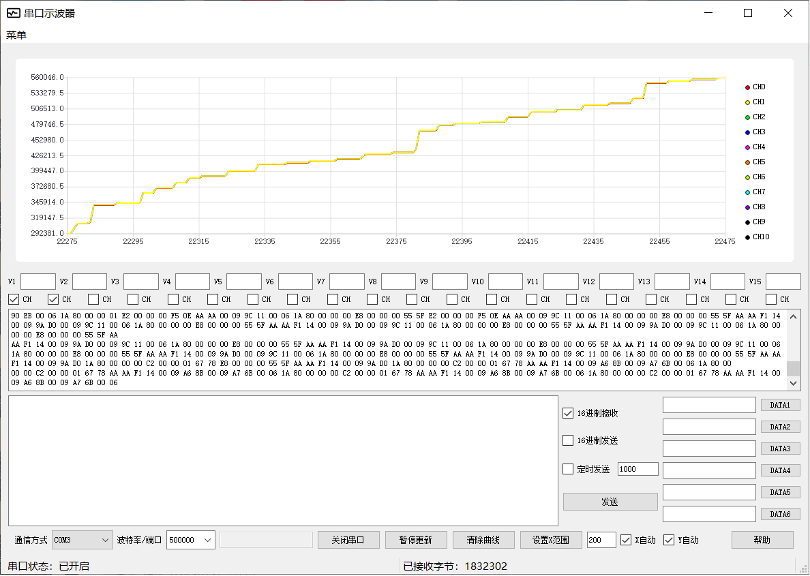

# serial_net_graph
功能：
1.串口通信，可进行串口数据的波形显示；
2.支持tcp、udp通信，同样能进行数据的波形显示；
说明:数据协议的格式；
（第1,2字节）AAAA帧头；
（第3字节）f1帧标识；
（第4字节）数据部分字节数；
（第5-n字节）用户数据；
（第n+1字节）校验和，校验和计算范围（第一字节 至 第n字节）；
例如：
AA AA F1 14 00 4E 1F F0 00 4E 20 BE 00 00 00 00 00 00 00 60 00 00 00 E3 25

